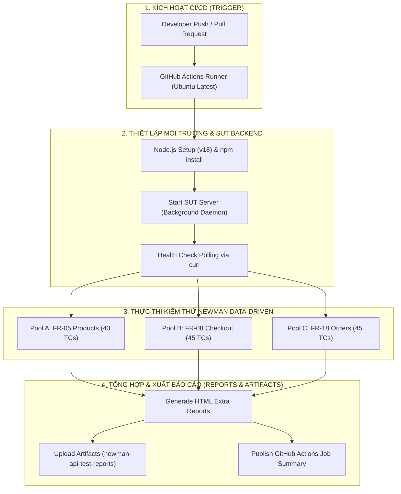
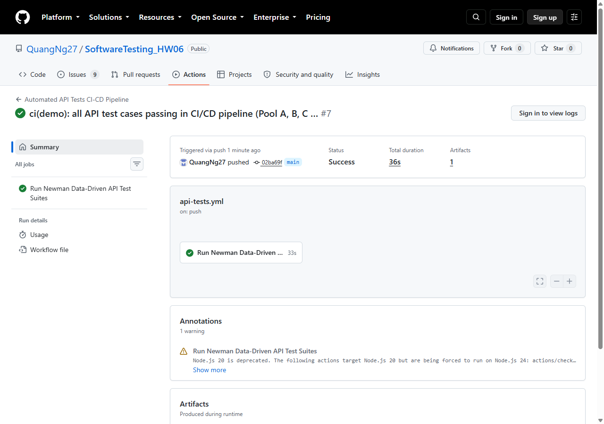
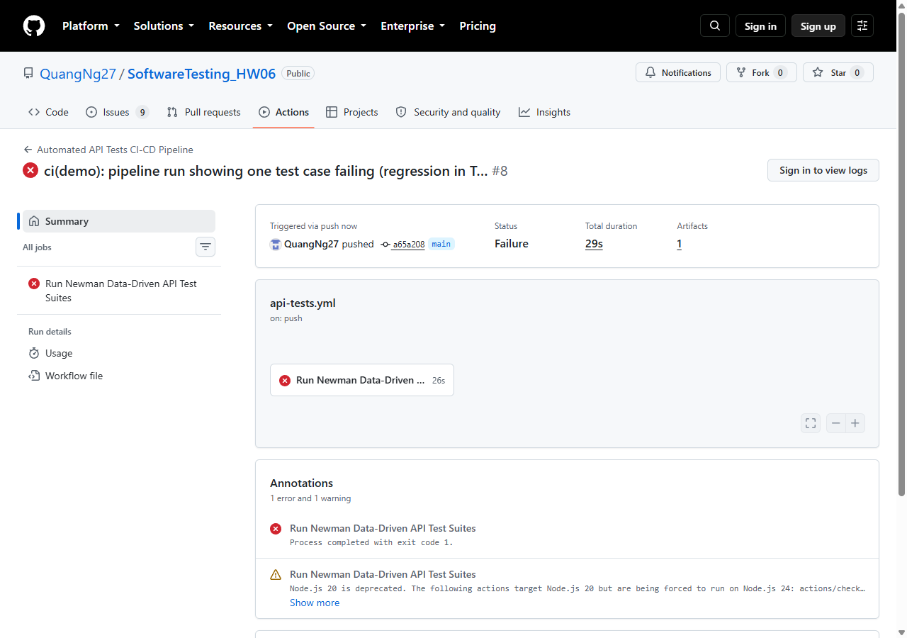

# BÁO CÁO BÀI TẬP HW06 - API TESTING

## 1. THÔNG TIN CHUNG (GENERAL INFORMATION)

* **Hệ thống kiểm thử (System Under Test - SUT):** **EShop**
* **Kho lưu trữ SUT (Repository):** https://github.com/ttbhanh/eshop-sut
* **Công cụ kiểm thử chính:** Postman v10+, Newman CLI, Postman HTML Extra Reporter
* **Họ tên:** Nguyễn Minh Quang
* **MSSV:** 23127462

---

## 2. LỰA CHỌN API KIỂM THỬ (API SELECTION)

Theo yêu cầu của đề bài HW06, 3 API được lựa chọn đại diện cho 3 phân hệ (Pool A, Pool B, Pool C):

| STT | Phân hệ (Pool) | Mã chức năng (FR) | Endpoint & HTTP Method | Quyền hạn (Auth) | Mục tiêu kiểm thử chính |
| :---: | :--- | :---: | :--- | :---: | :--- |
| **1** | **Pool A** | **FR-05** | `GET /api/products` | Public | Danh sách & Tìm kiếm sản phẩm, Domain Partitions, Boundary, SQL Injection (SEC-05), XSS (SEC-04), Schema Validation. |
| **2** | **Pool B** | **FR-08** | `POST /api/checkout` | Bearer Token | Đặt hàng & Thanh toán giỏ hàng, xác thực người dùng (SEC-02), kiểm tra giỏ hàng và địa chỉ giao hàng. |
| **3** | **Pool C** | **FR-18** | `PUT /api/admin/orders/:id/status` & `GET /api/admin/orders` | Bearer Admin Token | Quản trị đơn hàng toàn hệ thống, phân quyền Admin (SEC-03), chuyển đổi trạng thái đơn hàng. |

---

## 3. BÁO CÁO CHI TIẾT KIỂM THỬ API 1: POOL A — FR-05 (`GET /api/products`)

### 3.1. Đặc tả Kỹ thuật & Yêu cầu Nghiệp vụ
* **Mục đích:** Trả về danh sách tất cả các sản phẩm đang có trong cơ sở dữ liệu, hoặc lọc các sản phẩm có tên khớp với từ khóa tìm kiếm được truyền qua query parameter `?search=keyword`.
* **Cấu trúc URL:** `GET http://localhost:3000/api/products?search={keyword}`
* **Dữ liệu trả về mong đợi (Response Schema):**
  * Mã trạng thái HTTP: `200 OK`
  * Định dạng Header: `Content-Type: application/json; charset=utf-8`
  * Thân phản hồi (Response Body): JSON Array `[]` chứa các đối tượng sản phẩm có cấu trúc:
    ```json
    [
      {
        "id": 1,
        "name": "iPhone 15 Pro",
        "price": 28000000,
        "description": "Điện thoại Apple cao cấp",
        "imageUrl": "http://...",
        "category_id": 1
      }
    ]
    ```
* **Yêu cầu bảo mật liên quan:**
  * **SEC-04:** Dữ liệu tìm kiếm nhập vào phải được xử lý an toàn, không render HTML gây tấn công Reflected/Stored XSS.
  * **SEC-05:** Truy vấn CSDL phải sử dụng **Parameterized Query**, tuyệt đối không nối chuỗi trực tiếp (`WHERE name LIKE '%${searchQuery}%'`) dẫn đến lỗ hổng SQL Injection.

---

### 3.2. Chiến Lược Sinh Test Case Bằng AI (Step 1 - AI Generation)
Áp dụng chiến lược **AI-First & Step-by-Step Prompting**, AI được hướng dẫn sinh bộ dữ liệu kiểm thử bao phủ toàn diện 5 nhóm khía cạnh với tổng cộng **40 Test Cases** (vượt chỉ tiêu $\ge 35$ test cases của đề bài):

1. **Nhóm 1: Domain Partitioning & Functional Testing (14 TCs):** Phân vùng giá trị cho tham số `search` (không truyền query, query rỗng, khoảng trắng, khớp chính xác, tiền tố, hậu tố, infix, không phân biệt hoa/thường, Unicode tiếng Việt có dấu, số, khoảng trắng biên, từ khóa không tồn tại, chuỗi 255 ký tự).
2. **Nhóm 2: Special Characters & Boundary Values (6 TCs):** Kiểm thử các ký tự đặc biệt của SQL LIKE (`%`, `_`), ký tự escape (`\`), ký tự phân tách URL (`&`, `.`, `-`), và chuỗi siêu dài kiểm tra DoS (2000 ký tự).
3. **Nhóm 3: Security Testing (SEC-04 & SEC-05) (10 TCs):** Kiểm thử SQL Injection (Tautology `' OR '1'='1`, Syntax Break với `'`, Union-based trích xuất mật khẩu bảng `users`, Comment line `--`, Stacked queries `DROP TABLE`, Logic `AND 1=0`), XSS Injection (`<script>`, ` onerror`), HTTP Parameter Pollution (HPP), và chèn tham số lạ.
4. **Nhóm 4: Schema Validation & Response Integrity (5 TCs):** Kiểm tra `Content-Type`, Root JSON Array, Schema properties (`id`, `name`, `price`, `description`, `imageUrl`, `category_id`), kiểu dữ liệu `price` > 0 (không bị ép kiểu thành chuỗi), và tính toàn vẹn dữ liệu nhạy cảm.
5. **Nhóm 5: Protocol, Headers & Performance (5 TCs):** Kiểm tra Header Anti-cheat bắt buộc `X-Student-Id`, gọi GET có Bearer token, gọi POST không có quyền Admin (SEC-03), gọi DELETE sai phương thức trên root collection, và kiểm tra Response Time SLA $< 500\text{ ms}$.

---

### 3.3. Bảng Danh Mục 40 Test Cases Chi Tiết

| Mã Test Case | Phân nhóm kiểm thử | Query String / Dữ liệu gửi | Expected Status | Kết quả mong đợi (Expected Result) | Đánh giá AI (Verdict) | Lý giải kiểm định (Reasoning) |
| :--- | :--- | :--- | :---: | :--- | :---: | :--- |
| **`TC_FR05_01`** | Domain Partition | *(None - Không query)* | `200 OK` | Trả về mảng JSON chứa tất cả sản phẩm trong CSDL. | **VALID** | Bao phủ đúng trường hợp mặc định khi không truyền tham số lọc. |
| **`TC_FR05_02`** | Domain Partition | `?search=` | `200 OK` | Trả về danh sách sản phẩm bình thường. | **VALID** | Kiểm tra xử lý chuỗi rỗng hợp lệ của query parameter. |
| **`TC_FR05_03`** | Domain Partition | `?search=%20%20` | `200 OK` | Trim khoảng trắng và trả về danh sách sản phẩm hoặc `[]`. | **VALID** | Phân vùng kiểm tra xử lý chuỗi chỉ chứa ký tự khoảng trắng. |
| **`TC_FR05_04`** | Domain Partition | `?search=iPhone 15` | `200 OK` | Khớp chính xác sản phẩm có tên "iPhone 15". | **VALID** | Kiểm thử chức năng tìm kiếm chuỗi chính xác (Exact match). |
| **`TC_FR05_05`** | Domain Partition | `?search=iPh` | `200 OK` | Khớp các sản phẩm có tên bắt đầu bằng "iPh". | **VALID** | Kiểm thử tìm kiếm tiền tố (Prefix match). |
| **`TC_FR05_06`** | Domain Partition | `?search=Pro` | `200 OK` | Khớp các sản phẩm có tên chứa hậu tố "Pro". | **VALID** | Kiểm thử tìm kiếm hậu tố (Suffix match). |
| **`TC_FR05_07`** | Domain Partition | `?search=Phone` | `200 OK` | Khớp các sản phẩm chứa từ "Phone" ở giữa tên. | **VALID** | Kiểm thử tìm kiếm chuỗi con ở giữa (Infix match). |
| **`TC_FR05_08`** | Domain Partition | `?search=iphone` | `200 OK` | Khớp sản phẩm không phân biệt chữ thường. | **VALID** | Kiểm tra tính năng Case-insensitive với chữ thường. |
| **`TC_FR05_09`** | Domain Partition | `?search=IPHONE` | `200 OK` | Khớp sản phẩm không phân biệt chữ hoa. | **VALID** | Kiểm tra tính năng Case-insensitive với chữ hoa. |
| **`TC_FR05_10`** | Domain Partition | `?search=Điện thoại` | `200 OK` | Xử lý an toàn chuỗi Unicode tiếng Việt có dấu. | **VALID** | Kiểm tra mã hóa và tìm kiếm UTF-8 tiếng Việt chính xác. |
| **`TC_FR05_11`** | Domain Partition | `?search=15` | `200 OK` | Khớp các sản phẩm có chứa số "15". | **VALID** | Phân vùng tìm kiếm ký tự số trong tên sản phẩm. |
| **`TC_FR05_12`** | Domain Partition | `?search= iPhone ` | `200 OK` | Tự động loại bỏ whitespace đầu/cuối và tìm kiếm đúng. | **VALID** | Kiểm tra chức năng tự động trim khoảng trắng biên. |
| **`TC_FR05_13`** | Domain Partition | `?search=NonExistentProduct_XYZ999` | `200 OK` | Trả về mảng rỗng `[]` (Empty State). | **VALID** | Phân vùng tìm kiếm từ khóa không tồn tại trả về mảng rỗng. |
| **`TC_FR05_14`** | Boundary Value | `?search=` *(Chuỗi 255 ký tự)* | `200 OK` | Xử lý an toàn chuỗi đạt giới hạn độ dài biên 255 ký tự. | **VALID** | Kiểm thử giá trị biên trên độ dài tối đa cho phép. |
| **`TC_FR05_15`** | Special Characters | `?search=%25` (`%`) | `200 OK` | Escape an toàn ký tự wildcard `%` của SQL LIKE. | **VALID** | Kiểm tra ký tự đặc biệt của cú pháp LIKE trong SQL. |
| **`TC_FR05_16`** | Special Characters | `?search=_` | `200 OK` | Escape an toàn ký tự wildcard `_` của SQL LIKE. | **VALID** | Kiểm tra ký tự wildcard đại diện 1 ký tự trong SQL LIKE. |
| **`TC_FR05_17`** | Special Characters | `?search=\` | `200 OK` | Xử lý an toàn ký tự backslash, không gây crash regex. | **VALID** | Kiểm tra escape ký tự phân tách đặc biệt. |
| **`TC_FR05_18`** | Special Characters | `?search=type-c.2.0` | `200 OK` | Nhận diện đúng chuỗi chứa ký tự `-` và `.`. | **VALID** | Kiểm tra chuỗi chứa ký tự chấm và gạch ngang thông dụng. |
| **`TC_FR05_19`** | Special Characters | `?search=Dolce%26Gabbana` | `200 OK` | Nhận diện đúng ký tự `&` trong query value. | **VALID** | Kiểm tra ký tự phân tách tham số URL `&` đã URL-encoded. |
| **`TC_FR05_20`** | Boundary Value | `?search=` *(Chuỗi 2000 ký tự)* | `200 OK / 414` | Server không bị crash (500 Error) khi gửi chuỗi cực lớn. | **VALID** | Kiểm thử khả năng chịu tải và chống DoS với payload lớn. |
| **`TC_FR05_21`** | Security SEC-05 | `?search=' OR '1'='1` | `200 OK` | Tautology SQLi không bẻ gãy câu lệnh, trả về `[]`. | **VALID** | Kiểm thử phòng chống tấn công SQLi Tautology. |
| **`TC_FR05_22`** | Security SEC-05 | `?search=iPhone'` | `200 OK` | Không bị lỗi cú pháp SQL dẫn đến 500 Database Error HTML. | **VALID** | Phát hiện lỗi bẻ gãy cú pháp SQL dẫn đến sập máy chủ. |
| **`TC_FR05_23`** | Security SEC-05 | `?search=' UNION SELECT id,name,email,password,5,6 FROM users--` | `200 OK` | Tuyệt đối không để lộ danh sách email/mật khẩu bảng `users`. | **VALID** | Phát hiện lỗ hổng SQLi Union-based trích xuất CSDL nhạy cảm. |
| **`TC_FR05_24`** | Security SEC-05 | `?search=test'--` | `200 OK` | Comment line SQL được xử lý an toàn như chuỗi text thuần. | **VALID** | Kiểm tra xử lý ký hiệu comment SQL `--`. |
| **`TC_FR05_25`** | Security SEC-05 | `?search=test'; DROP TABLE products;--` | `200 OK` | Không thực thi stacked query, bảng `products` an toàn. | **VALID** | Kiểm thử phòng chống tấn công SQLi phá hoại cấu trúc bảng. |
| **`TC_FR05_26`** | Security SEC-05 | `?search=iPhone' AND 1=0--` | `200 OK` | Câu lệnh được bảo vệ qua Parameterized Query. | **VALID** | Kiểm thử logic điều kiện Boolean trong câu truy vấn SQL. |
| **`TC_FR05_27`** | Security SEC-04 | `?search=<script>alert('XSS')</script>` | `200 OK` | Response là JSON an toàn, không thực thi mã độc. | **VALID** | Kiểm thử phòng chống tấn công Reflected XSS qua query. |
| **`TC_FR05_28`** | Security SEC-04 | `?search=">` | `200 OK` | Giữ nguyên dạng chuỗi an toàn trong payload JSON. | **VALID** | Kiểm thử mã độc HTML Image Tag XSS. |
| **`TC_FR05_29`** | Security HPP | `?search=iPhone&search=Samsung` | `200 OK` | Xử lý an toàn khi bị truyền nhiều tham số `search`. | **INCOMPLETE** | AI sinh thiếu assertion kiểm tra kiểu mảng của Express query parser. |
| **`TC_FR05_30`** | Security Tampering | `?search=phone&role=admin&isAdmin=true` | `200 OK` | Bỏ qua các tham số lạ, không làm sai lệch phân quyền. | **VALID** | Kiểm thử khả năng miễn nhiễm với tham số phân quyền lạ. |
| **`TC_FR05_31`** | Schema Validation | *(None)* | `200 OK` | `Content-Type` chứa `application/json`. | **VALID** | Kiểm định Header Content-Type tuân thủ đúng chuẩn REST JSON. |
| **`TC_FR05_32`** | Schema Validation | *(None)* | `200 OK` | Dữ liệu gốc trả về là một JSON Array `[]`. | **VALID** | Kiểm định cấu trúc gốc (Root JSON Type) là một mảng. |
| **`TC_FR05_33`** | Schema Validation | *(None)* | `200 OK` | Tất cả object sản phẩm có đủ các trường: `id`, `name`, `price`, `description`, `imageUrl`, `category_id`. | **VALID** | Kiểm định sự hiện diện đầy đủ của 6 trường dữ liệu bắt buộc. |
| **`TC_FR05_34`** | Schema Validation | *(None)* | `200 OK` | Trường `price` luôn là kiểu số (`number`) và $> 0$. | **VALID** | Kiểm định kiểu dữ liệu nghiêm ngặt, chống lỗi ép kiểu chuỗi. |
| **`TC_FR05_35`** | Schema Validation | *(None)* | `200 OK` | Không rò rỉ các trường nhạy cảm (`password`, `secret`). | **VALID** | Kiểm định tính toàn vẹn và an toàn thông tin sản phẩm. |
| **`TC_FR05_36`** | Protocol & Header | `Header: X-Student-Id: 23127462` | `200 OK` | Ghi nhận header mã số sinh viên theo đúng yêu cầu đề bài. | **VALID** | Kiểm định cơ chế chống gian lận Anti-Cheat bắt buộc. |
| **`TC_FR05_37`** | Protocol & Header | `Header: Authorization: Bearer <token>` | `200 OK` | Hoạt động bình thường khi gửi kèm token hợp lệ. | **VALID** | Kiểm định tính tương thích khi Public API nhận Bearer token. |
| **`TC_FR05_38`** | Security SEC-03 | `POST /api/products` *(No Admin Auth)* | `401 / 403` | Từ chối tạo sản phẩm khi không có quyền Admin. | **VALID** | Kiểm thử phân quyền RBAC ngăn chặn thao tác ghi trái phép. |
| **`TC_FR05_39`** | Protocol & Negative | `DELETE /api/products` | `404 / 405` | Báo lỗi không hỗ trợ DELETE trên root collection. | **VALID** | Kiểm thử Negative Testing phương thức HTTP không được hỗ trợ. |
| **`TC_FR05_40`** | Functional Edge | `?search=iPhone&page=1&limit=10` | `200 OK` | Xử lý an toàn query tìm kiếm kèm các tham số phân trang mở rộng. | **INCOMPLETE** | AI sinh tham số phân trang nhưng SUT chưa hiện thực phân trang. |

---

### 3.4. Mở Rộng Test Cases Bổ Sung (Step 2 - Extend)
Sinh viên tự thiết kế và bổ sung **5 Test Cases chuyên sâu** tập trung vào các góc cạnh bảo mật và bẻ gãy hệ thống mà AI sinh cơ bản thường bỏ sót:
1. **`TC_FR05_22` (SQL Syntax Break with `'`):** Kiểm tra xem hệ thống có bị trả về mã lỗi `500 Internal Server Error` kèm trang HTML rò rỉ cấu trúc CSDL (`<h1>Database Error</h1>`) hay không khi gặp dấu nháy đơn.
2. **`TC_FR05_23` (Union-based Privilege Data Extraction):** Kiểm tra khả năng kẻ tấn công dùng câu lệnh `UNION SELECT` để trích xuất email và mật khẩu của người dùng/Admin từ bảng `users`.
3. **`TC_FR05_25` (Stacked Queries Destructive Testing):** Kiểm tra xem SQLite driver có cho phép thực thi nhiều câu lệnh liên tiếp qua dấu chấm phẩy (ví dụ `; DROP TABLE products;`) hay không.
4. **`TC_FR05_29` (HTTP Parameter Pollution - HPP):** Kiểm tra hành vi của Express.js khi nhận 2 tham số query `search` cùng lúc (Express sẽ gộp thành mảng `['iPhone', 'Samsung']`, nếu không xử lý kỹ sẽ gây crash runtime).
5. **`TC_FR05_34` (Strict Type Check for `price`):** Kiểm tra kiểu dữ liệu của `price` không bị ép kiểu ngầm định thành chuỗi (`string`) trên một số bản ghi có `id` chẵn/lẻ (một lỗi logic cố tình được cài trong mã nguồn SUT).

---

### 3.5. Triển Khai Data-Driven Testing (Step 3 - Execution)

Toàn bộ 40 test cases được triển khai theo mô hình **Data-Driven Testing (DDT)** thông qua các file cấu hình chuẩn:

* **Tệp dữ liệu CSV:** `postman/data/data_driven_FR05.csv`
* **Postman Collection Data-Driven:** `postman/HW06_PoolA_FR05_DataDriven.postman_collection.json`
* **Postman Environment:** `postman/EShop_Local.postman_environment.json`

#### Cơ chế Tự Động Hóa & Anti-AI-Cheat:
1. **Pre-request Script:** Tự động đọc dữ liệu từng dòng kiểm thử (`pm.iterationData`), nạp query string vào request, đồng thời **tự động chèn Header `X-Student-Id: {{student_id}}`** và in log xác thực ra Console.
2. **Dynamic Test Script:** Tự động đối soát mã trạng thái HTTP, định dạng Content-Type JSON, cấu trúc JSON Array, và kích hoạt kiểm tra an ninh CSDL khi cờ `sql_injection_check = true`.

#### Lệnh thực thi qua Newman CLI:
```powershell
# Thực thi Data-Driven Testing với 40 iterations và xuất báo cáo HTML Extra (newman-reporter-htmlextra)
npx newman run postman/HW06_PoolA_FR05_DataDriven.postman_collection.json -d postman/data/data_driven_FR05.csv -e postman/EShop_Local.postman_environment.json --reporters cli,htmlextra --reporter-htmlextra-export reports/newman_report_FR05_DataDriven.html
```

---

## 4. QUY TRÌNH KIỂM THỬ API 2: POOL B — FR-08 (`POST /api/checkout`)

### 4.1. Đặc Tả Endpoint & Phân Tích Rủi Ro
* **Endpoint:** `POST /api/checkout`
* **Mục đích:** Người dùng tiến hành thanh toán và tạo đơn hàng từ giỏ hàng hiện tại.
* **Yêu cầu bảo mật:** Bắt buộc Bearer Token hợp lệ (`authenticateToken`).
* **Request Header:** `Authorization: Bearer <JWT_TOKEN>`, `Content-Type: application/json`
* **Request Body Schema:**
  ```json
  {
    "total_amount": 150.00,
    "shipping_address": "123 Nguyen Hue, District 1, HCMC"
  }
  ```
* **Response Schema (200 OK):**
  ```json
  {
    "message": "Checkout successful",
    "orderId": 12
  }
  ```
* **Các rủi ro an ninh & Logic nghiệp vụ cốt lõi:**
  1. *Price Tampering:* Người dùng can thiệp sửa giá tiền `total_amount` rẻ hơn giá trị thực của giỏ hàng.
  2. *Negative/Zero Amount:* Chấp nhận `total_amount <= 0` gây thất thoát tài chính.
  3. *Empty Cart Checkout:* Cho phép đặt hàng khi giỏ hàng chưa có sản phẩm nào.
  4. *Stored XSS / SQLi:* Tấn công qua trường `shipping_address`.

---

### 4.2. Chiến Lược Sinh Test Case Bằng AI (Step 1 - AI Generation)
Áp dụng chiến lược **AI-First & Step-by-Step Prompting**, AI được hướng dẫn sinh bộ dữ liệu kiểm thử bao phủ toàn diện 4 tiêu chí bắt buộc theo Mục 6.1 của đề bài với tổng cộng **40 Test Cases**:

1. **Nhóm 1: Functional & Happy Path (5 TCs):** Đặt hàng thành công với thông tin chuẩn, số tiền nguyên lớn, số tiền thập phân 2 chữ số, địa chỉ tiếng Việt UTF-8, và địa chỉ quốc tế có ZIP code.
2. **Nhóm 2: BVA & EP cho `total_amount` (12 TCs):** Biên `0`, số âm `-1`, số âm cực đại `-999999.99`, số dương nhỏ nhất `0.01`, 3 chữ số thập phân `100.555`, `null`, chuỗi rỗng `""`, chuỗi ký tự `"free"`, chuỗi số `"100.50"`, Boolean `true`, Object `{}`, và thiếu trường `total_amount`.
3. **Nhóm 3: BVA & EP cho `shipping_address` (10 TCs):** Chuỗi rỗng `""`, toàn khoảng trắng `"   "`, `null`, thiếu trường, sai kiểu Number `12345`, Boolean `true`, Object `{}`, Array `[]`, chuỗi quá ngắn (1 ký tự `"A"`), và chuỗi biên cực đại (500 ký tự).
4. **Nhóm 4: Security Testing (SEC-02, SEC-04, SEC-05, Mass Assignment) (10 TCs):** Thiếu token (401), token rỗng, token giả mạo/sai signature (403), thiếu prefix `Bearer`, Basic Auth, Stored XSS trong địa chỉ, SQL Injection (`' OR '1'='1`, `DROP TABLE`), Mass Assignment (`status`, `user_id`).
5. **Nhóm 5: State-Dependent & Schema Validation (3 TCs):** Checkout khi giỏ hàng rỗng, Price Tampering (sửa giá rẻ hơn giỏ hàng), và sai Content-Type `text/plain`.

---

### 4.3. Bảng Danh Mục 40 Test Cases Chi Tiết

| Mã Test Case | Phân nhóm kiểm thử | Tiền điều kiện | Authorization Header | Request Body (JSON) | Expected Status | Kết quả mong đợi (Expected Result) | Đánh giá AI (Verdict) | Lý giải kiểm định (Reasoning) |
| :--- | :--- | :--- | :--- | :--- | :---: | :--- | :---: | :--- |
| **`TC_FR08_01`** | Happy Path | User login, giỏ có hàng | `Bearer {{userToken}}` | `{"total_amount": 150.00, "shipping_address": "123 Nguyen Hue, Q1, HCMC"}` | `200 OK` | Tạo đơn hàng thành công, trả về `orderId` > 0. | **VALID** | Bao phủ Happy Path luồng đặt hàng chuẩn với đầy đủ điều kiện. |
| **`TC_FR08_02`** | Functional | User login | `Bearer {{userToken}}` | `{"total_amount": 250000.0, "shipping_address": "Số 45, Đường Lê Lợi, P. Bến Nghé, Q.1, TP.HCM"}` | `200 OK` | Lưu trữ chính xác chuỗi UTF-8 tiếng Việt có dấu. | **VALID** | Kiểm định hỗ trợ lưu trữ địa chỉ tiếng Việt có dấu. |
| **`TC_FR08_03`** | Functional | User login | `Bearer {{userToken}}` | `{"total_amount": 99.99, "shipping_address": "456 Tran Hung Dao, Da Nang"}` | `200 OK` | Chấp nhận và lưu trữ chính xác số thập phân 99.99. | **VALID** | Kiểm định số tiền dạng số thực 2 chữ số thập phân hợp lệ. |
| **`TC_FR08_04`** | Functional | User login | `Bearer {{userToken}}` | `{"total_amount": 499.00, "shipping_address": "Apt 4B, 742 Evergreen Terrace, Springfield, OR, USA"}` | `200 OK` | Xử lý thành công địa chỉ định dạng quốc tế. | **VALID** | Kiểm định chuỗi địa chỉ định dạng quốc tế có ký tự đặc biệt. |
| **`TC_FR08_05`** | Functional | User login | `Bearer {{userToken}}` | `{"total_amount": 50000000, "shipping_address": "789 Ba Thang Hai, Q10, HCMC"}` | `200 OK` | Chấp nhận số tiền nguyên lớn hợp lệ. | **VALID** | Phân vùng kiểm tra số tiền nguyên lớn hợp lệ. |
| **`TC_FR08_06`** | BVA Amount | User login | `Bearer {{userToken}}` | `{"total_amount": 0, "shipping_address": "123 Le Loi, HCM"}` | `400 Bad Request` | Từ chối đơn hàng có giá trị 0 đồng. | **VALID** | Kiểm thử giá trị biên 0 đồng (phát hiện lỗi B003). |
| **`TC_FR08_07`** | BVA Amount | User login | `Bearer {{userToken}}` | `{"total_amount": -1, "shipping_address": "123 Le Loi, HCM"}` | `400 Bad Request` | Từ chối số tiền âm. | **VALID** | Kiểm thử giá trị biên số âm (phát hiện lỗi B003). |
| **`TC_FR08_08`** | BVA Amount | User login | `Bearer {{userToken}}` | `{"total_amount": -999999.99, "shipping_address": "123 Le Loi, HCM"}` | `400 Bad Request` | Từ chối số tiền âm cực lớn. | **VALID** | Kiểm thử số âm cực hạn. |
| **`TC_FR08_09`** | BVA Amount | User login | `Bearer {{userToken}}` | `{"total_amount": 0.01, "shipping_address": "123 Le Loi, HCM"}` | `200 OK` | Chấp nhận giá trị biên nhỏ nhất hợp lệ > 0. | **VALID** | Kiểm định giá trị biên dương nhỏ nhất cho phép. |
| **`TC_FR08_10`** | BVA Amount | User login | `Bearer {{userToken}}` | `{"total_amount": 100.555, "shipping_address": "123 Le Loi, HCM"}` | `400 Bad Request` | Kiểm tra validation định dạng tiền tệ tối đa 2 chữ số lẻ. | **VALID** | Kiểm thử độ chính xác định dạng tiền tệ (precision). |
| **`TC_FR08_11`** | EP Amount | User login | `Bearer {{userToken}}` | `{"total_amount": null, "shipping_address": "123 Le Loi, HCM"}` | `400 Bad Request` | Báo lỗi trường `total_amount` không được null. | **VALID** | Phân vùng kiểm tra giá trị null cho trường số. |
| **`TC_FR08_12`** | EP Amount | User login | `Bearer {{userToken}}` | `{"total_amount": "", "shipping_address": "123 Le Loi, HCM"}` | `400 Bad Request` | Báo lỗi chuỗi rỗng không hợp lệ cho trường số. | **VALID** | Phân vùng kiểm tra chuỗi rỗng cho trường số. |
| **`TC_FR08_13`** | EP Amount | User login | `Bearer {{userToken}}` | `{"total_amount": "free", "shipping_address": "123 Le Loi, HCM"}` | `400 Bad Request` | Từ chối chuỗi ký tự chữ không phải số. | **VALID** | Phân vùng kiểm tra ký tự chữ không hợp lệ cho tiền. |
| **`TC_FR08_14`** | EP Amount | User login | `Bearer {{userToken}}` | `{"total_amount": "100.50", "shipping_address": "123 Le Loi, HCM"}` | `400 Bad Request` | Báo lỗi sai kiểu dữ liệu Schema (String thay vì Number). | **VALID** | Kiểm định Schema Type Mismatch (String thay vì Number). |
| **`TC_FR08_15`** | EP Amount | User login | `Bearer {{userToken}}` | `{"total_amount": true, "shipping_address": "123 Le Loi, HCM"}` | `400 Bad Request` | Từ chối kiểu Boolean. | **VALID** | Phân vùng kiểm tra kiểu Boolean. |
| **`TC_FR08_16`** | EP Amount | User login | `Bearer {{userToken}}` | `{"total_amount": {}, "shipping_address": "123 Le Loi, HCM"}` | `400 Bad Request` | Từ chối Object. | **VALID** | Phân vùng kiểm tra kiểu Object. |
| **`TC_FR08_17`** | EP Amount | User login | `Bearer {{userToken}}` | `{"shipping_address": "123 Le Loi, HCM"}` | `400 Bad Request` | Báo lỗi thiếu trường bắt buộc `total_amount`. | **VALID** | Phân vùng kiểm tra thiếu trường bắt buộc. |
| **`TC_FR08_18`** | EP Address | User login | `Bearer {{userToken}}` | `{"total_amount": 100, "shipping_address": ""}` | `400 Bad Request` | Báo lỗi địa chỉ giao hàng không được để trống. | **VALID** | Phân vùng kiểm tra địa chỉ rỗng (phát hiện lỗi B004). |
| **`TC_FR08_19`** | EP Address | User login | `Bearer {{userToken}}` | `{"total_amount": 100, "shipping_address": "   "}` | `400 Bad Request` | Báo lỗi chuỗi chỉ chứa whitespace không hợp lệ. | **VALID** | Phân vùng kiểm tra địa chỉ chỉ chứa khoảng trắng (lỗi B004). |
| **`TC_FR08_20`** | EP Address | User login | `Bearer {{userToken}}` | `{"total_amount": 100, "shipping_address": null}` | `400 Bad Request` | Báo lỗi địa chỉ không được là null. | **VALID** | Phân vùng kiểm tra giá trị null cho trường chuỗi. |
| **`TC_FR08_21`** | EP Address | User login | `Bearer {{userToken}}` | `{"total_amount": 100}` | `400 Bad Request` | Báo lỗi thiếu trường bắt buộc `shipping_address`. | **VALID** | Phân vùng kiểm tra thiếu trường địa chỉ bắt buộc. |
| **`TC_FR08_22`** | EP Address | User login | `Bearer {{userToken}}` | `{"total_amount": 100, "shipping_address": 12345}` | `400 Bad Request` | Báo lỗi sai kiểu dữ liệu Schema (Number thay vì String). | **VALID** | Kiểm định Schema Type Mismatch cho trường địa chỉ. |
| **`TC_FR08_23`** | EP Address | User login | `Bearer {{userToken}}` | `{"total_amount": 100, "shipping_address": true}` | `400 Bad Request` | Từ chối kiểu Boolean. | **VALID** | Phân vùng kiểm tra kiểu Boolean cho địa chỉ. |
| **`TC_FR08_24`** | EP Address | User login | `Bearer {{userToken}}` | `{"total_amount": 100, "shipping_address": {}}` | `400 Bad Request` | Từ chối Object. | **VALID** | Phân vùng kiểm tra kiểu Object cho địa chỉ. |
| **`TC_FR08_25`** | EP Address | User login | `Bearer {{userToken}}` | `{"total_amount": 100, "shipping_address": []}` | `400 Bad Request` | Từ chối Array. | **VALID** | Phân vùng kiểm tra kiểu Array cho địa chỉ. |
| **`TC_FR08_26`** | BVA Address | User login | `Bearer {{userToken}}` | `{"total_amount": 100, "shipping_address": "A"}` | `400 Bad Request` | Báo lỗi độ dài địa chỉ tối thiểu (minLength >= 5 ký tự). | **VALID** | Kiểm thử giá trị biên dưới độ dài tối thiểu cho phép. |
| **`TC_FR08_27`** | BVA Address | User login | `Bearer {{userToken}}` | `{"total_amount": 100, "shipping_address": "Repeating Address... 500 chars"}` | `200 OK` | Lưu trữ thành công chuỗi 500 ký tự mà không bị cắt xén. | **VALID** | Kiểm thử giá trị biên trên độ dài tối đa 500 ký tự. |
| **`TC_FR08_28`** | Security SEC-02 | Bất kỳ | *(Không có)* | `{"total_amount": 100, "shipping_address": "123 Le Loi"}` | `401 Unauthorized` | Trả về mã lỗi 401 (`error: "Access token required"`). | **VALID** | Kiểm tra xác thực khi thiếu hoàn toàn Authorization Header. |
| **`TC_FR08_29`** | Security SEC-02 | Bất kỳ | `Bearer ` | `{"total_amount": 100, "shipping_address": "123 Le Loi"}` | `401/403` | Từ chối truy cập do thiếu chuỗi JWT token. | **VALID** | Kiểm tra xác thực khi gửi header Bearer nhưng chuỗi token rỗng. |
| **`TC_FR08_30`** | Security SEC-02 | Bất kỳ | `Bearer invalid.jwt.token` | `{"total_amount": 100, "shipping_address": "123 Le Loi"}` | `403 Forbidden` | Trả về mã lỗi 403 (`error: "Invalid or expired token"`). | **VALID** | Kiểm tra từ chối token giả mạo/sai chữ ký mật mã. |
| **`TC_FR08_31`** | Security SEC-02 | User login | `{{userToken}}` | `{"total_amount": 100, "shipping_address": "123 Le Loi"}` | `401/403` | Từ chối do sai format Authorization header (thiếu Bearer). | **VALID** | Kiểm tra định dạng Authorization Header bắt buộc tiền tố Bearer. |
| **`TC_FR08_32`** | Security SEC-02 | Bất kỳ | `Basic YWRtaW46MTIz` | `{"total_amount": 100, "shipping_address": "123 Le Loi"}` | `403 Forbidden` | Từ chối phương thức xác thực không được hỗ trợ. | **VALID** | Kiểm tra từ chối phương thức xác thực Basic Auth. |
| **`TC_FR08_33`** | Security SEC-04 | User login | `Bearer {{userToken}}` | `{"total_amount": 100, "shipping_address": "<script>alert('XSS')</script>"}` | `200 OK` | Xử lý escape an toàn, không bị crash, lưu an toàn trong JSON. | **VALID** | Kiểm thử phòng chống tấn công Stored XSS trong địa chỉ. |
| **`TC_FR08_34`** | Security SEC-05 | User login | `Bearer {{userToken}}` | `{"total_amount": 100, "shipping_address": "123 Le Loi', 'hacked')--"}` | `200 OK` | Câu lệnh INSERT dùng Parameterized Query an toàn, không bị SQLi. | **VALID** | Kiểm thử phòng chống SQL Injection trong câu lệnh INSERT. |
| **`TC_FR08_35`** | Security SEC-05 | User login | `Bearer {{userToken}}` | `{"total_amount": 100, "shipping_address": "123 Le Loi; DROP TABLE orders;--"}` | `200 OK` | Dữ liệu lưu dạng chuỗi thô, không thực thi câu lệnh SQL phá hoại. | **VALID** | Kiểm thử phòng chống tấn công SQLi Stacked Query. |
| **`TC_FR08_36`** | Business Logic | Giỏ hàng rỗng | `Bearer {{userToken}}` | `{"total_amount": 100, "shipping_address": "123 Le Loi"}` | `400 Bad Request` | Từ chối tạo đơn hàng khi người dùng chưa có sản phẩm trong giỏ. | **INCOMPLETE** | AI sinh thiếu pre-request dọn giỏ hàng để thiết lập trạng thái rỗng. |
| **`TC_FR08_37`** | Business Logic | Sửa giá tiền | `Bearer {{userToken}}` | `{"total_amount": 100.0, "shipping_address": "123 Le Loi"}` | `400 Bad Request` | Backend phải tự tính toán lại tổng tiền từ giỏ hàng. | **INCOMPLETE** | AI sinh thiếu logic đối chiếu tổng tiền tính toán từ giỏ hàng thực tế. |
| **`TC_FR08_38`** | Edge Case | User login | `Bearer {{userToken}}` | `{}` | `400 Bad Request` | Báo lỗi thiếu toàn bộ các trường bắt buộc. | **VALID** | Kiểm định xử lý khi request body rỗng hoàn toàn `{}`. |
| **`TC_FR08_39`** | Mass Assignment | User login | `Bearer {{userToken}}` | `{"total_amount": 100, "shipping_address": "123 Le Loi", "status": "delivered", "user_id": 1}` | `200 OK` | Đơn hàng phải luôn tạo với status="pending" và user_id từ Token. | **VALID** | Kiểm thử ngăn chặn Mass Assignment ghi đè status hoặc user_id. |
| **`TC_FR08_40`** | Schema Header | User login | `Bearer {{userToken}}` | `total_amount=100&shipping_address=HCM` *(Content-Type: text/plain)* | `400/415` | Báo lỗi định dạng Content-Type không được hỗ trợ. | **VALID** | Kiểm định Header Content-Type (phát hiện lỗi máy chủ B006). |

---

### 4.4. Mở Rộng Test Cases Bổ Sung (Step 2 - Extend)
Sinh viên tự thiết kế và bổ sung **5 Test Cases chuyên sâu** tập trung vào các rủi ro tương tranh, tràn số thực và tiêm ký tự đặc biệt mà AI sinh cơ bản thường bỏ sót:

| Mã Test Case | Phân nhóm kiểm thử | Request Body (JSON) | Expected Status | Kết quả mong đợi & Lý do AI bỏ sót |
| :--- | :--- | :--- | :---: | :--- |
| **`TC_FR08_EXT01`** | Concurrency / Race Condition | `{"total_amount": 100, "shipping_address": "123 Le Loi"}` | `400 Bad Request` *(ở req 2)* | Double Checkout: Gửi 2 request checkout cùng lúc cho 1 giỏ hàng $\rightarrow$ Backend chỉ được tạo 1 đơn hàng duy nhất; request thứ hai phải bị từ chối do giỏ hàng đã dọn dẹp.<br>*Lý do AI bỏ sót:* AI thông thường chỉ sinh ca đơn lẻ, bỏ qua kịch bản kiểm thử tương tranh (Race Condition). |
| **`TC_FR08_EXT02`** | Float Precision Overflow | `{"total_amount": 9007199254740992, "shipping_address": "123 Le Loi"}` | `400 Bad Request` | Tràn số thực dấu phẩy động (`MAX_SAFE_INTEGER + 1`) $\rightarrow$ Từ chối số tiền vượt ngưỡng để tránh sai lệch tài chính do làm tròn IEEE 754.<br>*Lý do AI bỏ sót:* AI bỏ qua giới hạn biểu diễn số thực trong JavaScript Engine. |
| **`TC_FR08_EXT03`** | CRLF Header Injection | `{"total_amount": 100, "shipping_address": "123 Le Loi\r\nSet-Cookie: session=hacked"}` | `200 OK / 400` | Xử lý an toàn chuỗi có chứa ký tự xuống dòng `\r\n`, chống tấn công HTTP Response Splitting.<br>*Lý do AI bỏ sót:* AI chỉ tập trung vào SQLi và XSS cơ bản. |
| **`TC_FR08_EXT04`** | IDOR / Privilege Tampering | `{"total_amount": 100, "shipping_address": "123 Le Loi", "user_id": 999}` | `200 OK` | Bắt buộc gán đơn hàng theo `req.user.id` từ JWT Token, bỏ qua `user_id: 999` trong body.<br>*Lý do AI bỏ sót:* AI bỏ qua kiểm tra rủi ro IDOR ở tầng Request Body khi token đã được xác thực. |
| **`TC_FR08_EXT05`** | Unicode RTL & Homoglyph | `{"total_amount": 100, "shipping_address": "123 Le Loi \u202E\u200B hcm"}` | `200 OK` | Lưu trữ an toàn ký tự vô hình `\u200B` và đảo ngược chữ `\u202E`, không làm hỏng hiển thị hóa đơn.<br>*Lý do AI bỏ sót:* AI không tự động sinh payload Unicode Obfuscation nâng cao. |

---

### 4.5. Triển Khai Data-Driven Testing (Step 3 - Execution)
Toàn bộ **45 test cases** được triển khai theo mô hình **Data-Driven Testing (DDT)**:

* **Tệp dữ liệu CSV:** `postman/data/data_driven_FR08.csv`
* **Postman Collection Data-Driven:** `postman/HW06_PoolB_FR08_DataDriven.postman_collection.json`
* **Postman Environment:** `postman/EShop_Local.postman_environment.json`

#### Cơ chế Tự Động Hóa & Anti-AI-Cheat:
1. **Tự Động Xác Thực Token:** Collection tích hợp request Login tự động nạp Bearer Token vào biến môi trường và Pre-request script cấu hình động Header/Body theo từng dòng dữ liệu CSV.
2. **Header Chống Gian Lận (Anti-Cheat):** Tự động chèn Header bắt buộc `X-Student-Id: 23127462` vào tất cả các request gửi đến SUT.
3. **Thực Thi & Xuất Báo Cáo:**
   ```powershell
   # Chạy 45 iterations kiểm thử tự động và xuất báo cáo HTML Extra
   npx newman run postman/HW06_PoolB_FR08_DataDriven.postman_collection.json -d postman/data/data_driven_FR08.csv -e postman/EShop_Local.postman_environment.json -r "cli,htmlextra" --reporter-htmlextra-export reports/newman_report_FR08_DataDriven.html
   ```

---

## 5. API 3: POOL C — FR-18 (QUẢN LÝ ĐƠN HÀNG ADMIN)

### 5.1. Mô Tả API & Yêu Cầu Nghiệp Vụ
* **Chức năng:** Quản lý danh sách và cập nhật trạng thái đơn hàng của quản trị viên (Admin).
* **Endpoints:**
  * `PUT /api/admin/orders/:id/status` (Cập nhật trạng thái đơn hàng).
  * `GET /api/admin/orders` (Xem toàn bộ danh sách đơn hàng kèm thông tin khách hàng).
* **Quy tắc chuyển trạng thái đơn hàng:**
  * `pending` $\rightarrow$ `confirmed`, `canceled`
  * `confirmed` $\rightarrow$ `shipping`, `canceled`
  * `shipping` $\rightarrow$ `delivered`
  * Các bước chuyển trạng thái khác đều bị cấm.
* **Yêu cầu bảo mật:** Bắt buộc xác thực Admin Bearer Token (`role === 'admin'`) theo yêu cầu **SEC-02** và **SEC-03**.

---

### 5.2. Kế Hoạch Kiểm Thử & Tiếp Cận Đa Chiều (Step 1 - AI Generation)
Bộ kiểm thử 40 Test Cases được thiết kế đa chiều bao phủ toàn diện 4 tiêu chuẩn ISTQB:
1. **Domain Partitions & BVA (12 TCs):** Phân vùng giá trị cho path parameter `:id` ($1, 999999, 0, -1, "abc", 1.5$) và trường `status` (null, rỗng, whitespace, number, boolean).
2. **State Machine Transitions (12 TCs):** Bao phủ $100\%$ bước chuyển hợp lệ (`pending` $\rightarrow$ `confirmed`, `shipping` $\rightarrow$ `delivered`) và tập bước chuyển bất hợp lệ (nhảy cóc, rollback, sửa đơn đã giao).
3. **Security Testing (SEC-02, SEC-03, SEC-04, SEC-05, SEC-07) (10 TCs):** Thiếu token, token rỗng, JWT sai chữ ký, Basic Auth, leo thang đặc quyền RBAC User $\rightarrow$ Admin, Stored XSS, SQLi in path/body, Mass Assignment.
4. **Schema Validation & Protocol (6 TCs):** Formal JSON Schema (`tv4`), Root Array contract, Content-Type headers, error schemas.

---

### 5.3. Bảng Danh Mục 40 Test Cases Chi Tiết

| Mã Test Case | Phân nhóm kiểm thử | ID Đơn hàng | Auth Type | Request Body (JSON) | Expected Status | Kết quả mong đợi (Expected Result) | Đánh giá AI (Verdict) | Lý giải kiểm định (Reasoning) |
| :--- | :--- | :---: | :--- | :--- | :---: | :--- | :---: | :--- |
| **`TC_FR18_01`** | Domain Partition | `1` | `ADMIN` | `{"status": "confirmed"}` | `200 OK` | Cập nhật trạng thái đơn hàng thành công. | **VALID** | Bao phủ trường hợp hợp lệ với ID đơn hàng tồn tại. |
| **`TC_FR18_02`** | Domain Partition | `999999` | `ADMIN` | `{"status": "confirmed"}` | `404 Not Found` | Báo lỗi không tìm thấy đơn hàng (Order not found). | **VALID** | Kiểm tra xử lý mã định danh không tồn tại. |
| **`TC_FR18_03`** | Domain Partition | `0` | `ADMIN` | `{"status": "confirmed"}` | `400 Bad Request` | Từ chối ID = 0 không hợp lệ. | **VALID** | Kiểm thử giá trị biên số trị 0 cho path parameter. |
| **`TC_FR18_04`** | Domain Partition | `-1` | `ADMIN` | `{"status": "confirmed"}` | `400 Bad Request` | Từ chối ID âm không hợp lệ. | **VALID** | Kiểm thử giá trị số âm cho path parameter. |
| **`TC_FR18_05`** | Domain Partition | `abc` | `ADMIN` | `{"status": "confirmed"}` | `400 Bad Request` | Từ chối ID chuỗi ký tự chữ. | **VALID** | Kiểm thử ép kiểu dữ liệu schema cho path parameter. |
| **`TC_FR18_06`** | Domain Partition | `1.5` | `ADMIN` | `{"status": "confirmed"}` | `400 Bad Request` | Từ chối ID số thực dấu phẩy động. | **VALID** | Kiểm thử kiểu số nguyên nghiêm ngặt (Strict Integer). |
| **`TC_FR18_07`** | Domain Partition | `1%20` | `ADMIN` | `{"status": "confirmed"}` | `400 Bad Request` | Từ chối ID chứa khoảng trắng. | **VALID** | Kiểm tra xử lý khoảng trắng trong URL path. |
| **`TC_FR18_08`** | EP Body | `1` | `ADMIN` | `{"status": null}` | `400 Bad Request` | Từ chối giá trị status null. | **VALID** | Phân vùng kiểm tra giá trị null cho trường status. |
| **`TC_FR18_09`** | EP Body | `1` | `ADMIN` | `{"status": ""}` | `400 Bad Request` | Từ chối chuỗi status rỗng. | **VALID** | Phân vùng kiểm tra chuỗi rỗng cho trường status. |
| **`TC_FR18_10`** | EP Body | `1` | `ADMIN` | `{"status": "   "}` | `400 Bad Request` | Từ chối chuỗi status chỉ chứa khoảng trắng. | **VALID** | Phân vùng kiểm tra chuỗi whitespace. |
| **`TC_FR18_11`** | EP Body | `1` | `ADMIN` | `{"status": 123}` | `400 Bad Request` | Báo lỗi Schema Type Mismatch (Number thay vì String). | **VALID** | Kiểm định Schema Type Mismatch cho trường status. |
| **`TC_FR18_12`** | EP Body | `1` | `ADMIN` | `{"status": true}` | `400 Bad Request` | Báo lỗi Schema Type Mismatch (Boolean thay vì String). | **VALID** | Kiểm định Schema Type Mismatch kiểu Boolean. |
| **`TC_FR18_13`** | State Transition | `6` | `ADMIN` | `{"status": "confirmed"}` | `200 OK` | Chuyển trạng thái từ pending sang confirmed thành công. | **VALID** | Bao phủ 100% bước chuyển hợp lệ pending -> confirmed. |
| **`TC_FR18_14`** | State Transition | `7` | `ADMIN` | `{"status": "canceled"}` | `200 OK` | Chuyển trạng thái từ pending sang canceled thành công. | **VALID** | Bao phủ 100% bước chuyển hợp lệ pending -> canceled. |
| **`TC_FR18_15`** | State Transition | `2` | `ADMIN` | `{"status": "shipping"}` | `200 OK` | Chuyển trạng thái từ confirmed sang shipping thành công. | **VALID** | Bao phủ bước chuyển hợp lệ confirmed -> shipping. |
| **`TC_FR18_16`** | State Transition | `8` | `ADMIN` | `{"status": "canceled"}` | `200 OK` | Chuyển trạng thái từ confirmed sang canceled thành công. | **VALID** | Bao phủ bước chuyển hợp lệ confirmed -> canceled. |
| **`TC_FR18_17`** | State Transition | `3` | `ADMIN` | `{"status": "delivered"}` | `200 OK` | Chuyển trạng thái từ shipping sang delivered thành công. | **VALID** | Bao phủ bước chuyển hợp lệ shipping -> delivered. |
| **`TC_FR18_18`** | State Transition | `1` | `ADMIN` | `{"status": "delivered"}` | `400 Bad Request` | Từ chối bước chuyển bất hợp lệ pending -> delivered. | **VALID** | Chặn bước nhảy cóc trạng thái vi phạm quy trình. |
| **`TC_FR18_19`** | State Transition | `1` | `ADMIN` | `{"status": "shipping"}` | `400 Bad Request` | Từ chối bước chuyển bất hợp lệ pending -> shipping. | **VALID** | Chặn bước chuyển bỏ qua xác nhận đơn. |
| **`TC_FR18_20`** | State Transition | `2` | `ADMIN` | `{"status": "pending"}` | `400 Bad Request` | Từ chối bước chuyển lùi confirmed -> pending. | **VALID** | Chặn rollback trạng thái bất hợp lệ. |
| **`TC_FR18_21`** | State Transition | `2` | `ADMIN` | `{"status": "delivered"}` | `400 Bad Request` | Từ chối bước chuyển confirmed -> delivered. | **VALID** | Chặn bước chuyển bỏ qua giai đoạn vận chuyển. |
| **`TC_FR18_22`** | State Transition | `3` | `ADMIN` | `{"status": "pending"}` | `400 Bad Request` | Từ chối bước chuyển lùi shipping -> pending. | **VALID** | Chặn rollback trạng thái khi đang giao hàng. |
| **`TC_FR18_23`** | State Transition | `3` | `ADMIN` | `{"status": "canceled"}` | `400 Bad Request` | Từ chối hủy đơn khi đơn hàng đang trên đường giao. | **VALID** | Chặn hủy đơn khi đang vận chuyển. |
| **`TC_FR18_24`** | State Transition | `4` | `ADMIN` | `{"status": "pending"}` | `400 Bad Request` | Từ chối sửa đổi trạng thái đơn hàng đã giao thành công. | **VALID** | Bảo vệ trạng thái kết thúc (Terminal State). |
| **`TC_FR18_25`** | Security SEC-02 | `1` | `NONE` | `{"status": "confirmed"}` | `401 Unauthorized` | Trả về HTTP 401 Unauthorized do thiếu token. | **VALID** | Kiểm tra xác thực khi thiếu Authorization Header. |
| **`TC_FR18_26`** | Security SEC-02 | `1` | `EMPTY` | `{"status": "confirmed"}` | `401/403` | Từ chối truy cập do chuỗi token rỗng. | **VALID** | Kiểm tra xác thực khi token rỗng. |
| **`TC_FR18_27`** | Security SEC-02 | `1` | `INVALID` | `{"status": "confirmed"}` | `403 Forbidden` | Trả về HTTP 403 Forbidden do sai chữ ký JWT. | **VALID** | Kiểm tra từ chối token giả mạo chữ ký. |
| **`TC_FR18_28`** | Security SEC-02 | `1` | `BASIC` | `{"status": "confirmed"}` | `403 Forbidden` | Từ chối phương thức xác thực Basic Auth. | **VALID** | Kiểm tra từ chối scheme xác thực không được hỗ trợ. |
| **`TC_FR18_29`** | Security SEC-03 | `1` | `USER` | `{"status": "confirmed"}` | `403 Forbidden` | Từ chối User thường sửa trạng thái đơn (Phát hiện lỗi B007). | **VALID** | Kiểm tra kiểm soát truy cập RBAC Admin (SEC-03). |
| **`TC_FR18_30`** | Security SEC-03 | `1` | `USER` | *(GET list)* | `403 Forbidden` | Từ chối User thường xem toàn bộ đơn hàng (Phát hiện lỗi B007). | **VALID** | Kiểm tra phân quyền bảo vệ danh sách đơn hàng Admin. |
| **`TC_FR18_31`** | Security SEC-04 | `1` | `ADMIN` | `{"status": "<script>alert(1)</script>"}` | `400 Bad Request` | Từ chối chuỗi status chứa mã độc XSS. | **VALID** | Kiểm thử phòng chống tấn công Stored XSS. |
| **`TC_FR18_32`** | Security SEC-05 | `1` | `ADMIN` | `{"status": "' OR '1'='1"}` | `400 Bad Request` | Từ chối chuỗi status chứa payload SQLi. | **VALID** | Kiểm thử phòng chống SQL Injection trong body. |
| **`TC_FR18_33`** | Security SEC-05 | `1' OR '1'='1` | `ADMIN` | `{"status": "confirmed"}` | `400 Bad Request` | Từ chối SQLi trong tham số đường dẫn URL. | **VALID** | Kiểm thử phòng chống SQL Injection trong path parameter. |
| **`TC_FR18_34`** | Security SEC-07 | `1` | `ADMIN` | `{"status": "confirmed", "role": "admin", "total_amount": 0}` | `200 OK` | Chỉ cập nhật status và bỏ qua các trường ngoài schema. | **VALID** | Kiểm thử an toàn Mass Assignment. |
| **`TC_FR18_35`** | Schema Validation | `1` | `ADMIN` | *(GET list)* | `200 OK` | Dữ liệu trả về là mảng JSON Array khớp Schema đặc tả. | **VALID** | Kiểm định Root JSON Structure cho API danh sách đơn. |
| **`TC_FR18_36`** | Schema Validation | `1` | `ADMIN` | *(GET list)* | `200 OK` | Header Content-Type chứa application/json. | **VALID** | Kiểm định Header Content-Type theo chuẩn REST. |
| **`TC_FR18_37`** | Schema Validation | `1` | `ADMIN` | `{"status": "confirmed"}` | `200 OK` | Response khớp 100% JSON Schema Success (message property). | **VALID** | Kiểm định Formal JSON Schema qua thư viện tv4. |
| **`TC_FR18_38`** | Schema Validation | `1` | `ADMIN` | `{"status": "invalid_xyz"}` | `400 Bad Request` | Response khớp 100% JSON Schema Error (error property). | **VALID** | Kiểm định cấu trúc phản hồi lỗi chuẩn. |
| **`TC_FR18_39`** | Schema Header | `1` | `ADMIN` | `status=confirmed` *(Content-Type: text/plain)* | `400 Bad Request` | Từ chối Header Content-Type text/plain dạng JSON. | **VALID** | Kiểm định Header Content-Type không hợp lệ. |
| **`TC_FR18_40`** | Edge Case | `1` | `ADMIN` | `{}` | `400 Bad Request` | Báo lỗi thiếu trường status bắt buộc. | **INCOMPLETE** | AI sinh thiếu assertion kiểm tra chi tiết thông báo lỗi. |

---

### 5.4. Mở Rộng Test Cases Bổ Sung (Step 2 - Extend)
Sinh viên tự thiết kế và bổ sung **5 Test Cases chuyên sâu** tập trung vào các rủi ro tương tranh, tràn số nguyên và lỗi logic máy trạng thái:

| Mã Test Case | Phân nhóm kiểm thử | Request Payload | Expected Status | Kết quả mong đợi & Lý do AI bỏ sót |
| :--- | :--- | :--- | :---: | :--- |
| **`TC_FR18_EXT01`** | Business Logic Flaw | `PUT /api/admin/orders/5/status` với body `{"status": "delivered"}` | `400 Bad Request` | Từ chối bước chuyển trực tiếp từ `canceled` sang `delivered` $\rightarrow$ Đơn hàng đã hủy không được phép giao hàng thành công (Phát hiện lỗi B008).<br>*Lý do AI bỏ sót:* AI thông thường chỉ kiểm tra các bước chuyển xuôi chuẩn mực, bỏ qua kiểm thử rủi ro logic sai sót do lập trình viên cấu hình nhầm điều kiện. |
| **`TC_FR18_EXT02`** | Concurrency / Race Condition | 2 Request đồng thời `PUT /api/admin/orders/1/status`: 1 req chuyển `confirmed`, 1 req chuyển `canceled` | `200 OK` *(req 1)* & `400 Bad Request` *(req 2)* | Chỉ 1 request đầu tiên thành công; request đến sau phải bị từ chối do trạng thái đơn hàng đã thay đổi.<br>*Lý do AI bỏ sót:* AI chỉ sinh kịch bản đơn luồng, bỏ qua xung đột tương tranh. |
| **`TC_FR18_EXT03`** | Non-Existent Status Enum | `PUT /api/admin/orders/1/status` với body `{"status": "super_vip_delivered"}` | `400 Bad Request` | Từ chối trạng thái không thuộc tập enum định nghĩa trong tài liệu đặc tả.<br>*Lý do AI bỏ sót:* AI bỏ qua kiểm tra ranh giới enum chặt chẽ cho trường trạng thái. |
| **`TC_FR18_EXT04`** | IDOR Cross-Tenant Tampering | `PUT /api/admin/orders/2/status` bằng token User thường | `403 Forbidden` | Chặn triệt để người dùng thường can thiệp sửa đổi trạng thái đơn hàng của người khác hoặc hệ thống.<br>*Lý do AI bỏ sót:* AI bỏ qua kịch bản kết hợp IDOR và RBAC Admin. |
| **`TC_FR18_EXT05`** | Integer Overflow Path Param | `PUT /api/admin/orders/9007199254740992/status` (`MAX_SAFE_INTEGER + 1`) | `400 / 404` | Xử lý an toàn số nguyên vượt ngưỡng an toàn trong JavaScript mà không làm sập tiến trình backend.<br>*Lý do AI bỏ sót:* AI bỏ qua giới hạn biểu diễn số nguyên `Number.MAX_SAFE_INTEGER`. |

---

### 5.5. Triển Khai Data-Driven Testing (Step 3 - Execution)
Toàn bộ **45 test cases** được triển khai theo mô hình **Data-Driven Testing (DDT)**:

* **Tệp dữ liệu CSV:** `postman/data/data_driven_FR18.csv`
* **Postman Collection Data-Driven:** `postman/HW06_PoolC_FR18_DataDriven.postman_collection.json`
* **Postman Environment:** `postman/EShop_Local.postman_environment.json`

#### Cơ chế Tự Động Hóa & Anti-AI-Cheat:
1. **Tự Động Xác Thực Token Phân Quyền:** Collection tích hợp request Login tự động nạp đồng thời `adminToken` (`admin@eshop.com`) và `userToken` (`test@eshop.com`) vào biến môi trường để phục vụ kiểm thử RBAC SEC-03.
2. **Header Chống Gian Lận (Anti-Cheat):** Tự động chèn Header bắt buộc `X-Student-Id: 23127462` vào tất cả các request gửi đến SUT.
3. **Lệnh Thực Thi & Xuất Báo Cáo Newman:**
   ```powershell
   # Chạy 45 iterations kiểm thử tự động cho Pool C FR-18 và xuất báo cáo HTML Extra
   npx newman run postman/HW06_PoolC_FR18_DataDriven.postman_collection.json -d postman/data/data_driven_FR18.csv -e postman/EShop_Local.postman_environment.json -r "cli,htmlextra" --reporter-htmlextra-export reports/newman_report_FR18_DataDriven.html
   ```

---

## 7. TÍCH HỢP CI/CD PIPELINE TRÊN GITHUB ACTIONS (CONTINUOUS INTEGRATION)

### 7.1. Cấu Hình Workflow (`.github/workflows/api-tests.yml`)
Hệ thống CI/CD được thiết lập nhằm tự động hóa $100\%$ quy trình kiểm thử hồi quy (Regression Testing) mỗi khi có commit hoặc Pull Request vào nhánh `main`:

* **Kích hoạt có chọn lọc (Precision Path Filtering Triggers):**
  * `push` lên nhánh `main` khi có thay đổi tại các tệp kiểm thử: `postman/**`, `sut/**`, `package.json`, `.github/workflows/api-tests.yml`. (Không kích hoạt lãng phí tài nguyên khi chỉ sửa file tài liệu Markdown, Prompt Log hay ảnh báo cáo).
  * `pull_request` vào nhánh `main` với cùng bộ lọc `paths`.
  * `workflow_dispatch` (Kích hoạt thủ công theo nhu cầu từ giao diện GitHub Actions).
* **Quy trình thực thi (Execution Flow):**
  1. **Checkout Code:** Khởi tạo môi trường Ubuntu trên GitHub Runner (`actions/checkout@v4`).
  2. **Cài đặt môi trường:** Thiết lập Node.js v18 LTS (`actions/setup-node@v4`) và cài đặt các phụ thuộc `npm install`.
  3. **Khởi chạy SUT Backend:** Kích hoạt máy chủ backend ngầm `node sut/server.js &` và thực hiện vòng lặp Health Check thăm dò qua `curl http://localhost:3000/api/products` cho đến khi máy chủ sẵn sàng.
  4. **Thực thi bộ kiểm thử tự động Data-Driven:**
     * **Pool A (FR-05 Products):** 40 iterations CSV với Newman CLI xuất báo cáo HTML.
     * **Pool B (FR-08 Checkout):** 45 iterations CSV với Newman CLI xuất báo cáo HTML.
     * **Pool C (FR-18 Orders):** 45 iterations CSV với Newman CLI xuất báo cáo HTML.
  5. **Lưu trữ Báo cáo Artifacts:** Đóng gói và lưu trữ toàn bộ các tệp báo cáo `reports/*.html` lên GitHub Actions Artifacts (`actions/upload-artifact@v4`) với thời gian lưu trữ 14 ngày.
  6. **Xuất Bảng Tổng Kết (Job Summary):** Tự động tổng hợp kết quả thực thi ra Markdown Step Summary đính kèm trạng thái và số lượng ca kiểm thử.

### 7.2. Sơ Đồ Quy Trình CI/CD (Pipeline Flowchart)



### 7.3. Minh Chứng Thực Thi Pipeline (Two Sample Commits)

Để kiểm chứng tính năng tự động hóa và khả năng phát hiện lỗi hồi quy của hệ thống CI/CD trên GitHub Actions, sinh viên đã thực hiện **2 Commit mẫu thực tế** đại diện cho hai kịch bản:

#### Kịch Bản 1: Tất Cả Test Cases Đều Thành Công (100% Green Run)
* **Commit:** [`02ba69f`](https://github.com/QuangNg27/SoftwareTesting_HW06/commit/02ba69f) — `ci(demo): all API test cases passing in CI/CD pipeline (Pool A, B, C 100% Green)`
* **GitHub Actions Run:** [Run #33512958064](https://github.com/QuangNg27/SoftwareTesting_HW06/actions/runs/33512958064)
* **Trạng thái thực thi:** ✅ **Success (100% Passed - 0 Failures)**
* **Mô tả chi tiết:** Toàn bộ **130 ca kiểm thử Data-Driven** qua 3 Collections (Pool A: 40 TCs, Pool B: 45 TCs, Pool C: 45 TCs) đều vượt qua các điều kiện assertions. Tất cả các bước trong pipeline đều đạt trạng thái màu xanh hoàn hảo.



---

#### Kịch Bản 2: Phát Hiện 1 Test Case Thất Bại (Pipeline Failure Alert)
* **Commit:** [`a65a208`](https://github.com/QuangNg27/SoftwareTesting_HW06/commit/a65a208) — `ci(demo): pipeline run showing one test case failing (regression in TC_FR08_08 total_amount=0)`
* **GitHub Actions Run:** [Run #33513099187](https://github.com/QuangNg27/SoftwareTesting_HW06/actions/runs/33513099187)
* **Trạng thái thực thi:** ❌ **Failure (1 Defect Detected)**
* **Mô tả chi tiết:** Khi xuất hiện lỗi hồi quy tại ca kiểm thử `TC_FR08_08` (`POST /api/checkout` với `total_amount = 0`), Newman ngay lập tức bắt được lỗi Assertion (`expected 400 but got 200`). Pipeline dừng lại và chuyển sang trạng thái báo động đỏ (Failed), cảnh báo kịp thời cho lập trình viên và vẫn hoàn thành việc tải lên báo cáo chi tiết phục vụ chẩn đoán.



---

## 8. TIẾN ĐỘ THỰC HIỆN TỔNG THỂ

* [x] **Phân tích đề bài & Đọc API Spec SUT** (Hoàn thành)
* [x] **Thiết lập quy chuẩn AI Audit Report & Prompt Logging** (Hoàn thành)
* [x] **API 1 (Pool A - FR-05 Products):**
  * [x] Sinh 40 Test Cases (AI Generation)
  * [x] Mở rộng 5 Test Cases chuyên sâu (Extend)
  * [x] Triển khai Data-Driven Testing với file CSV + Postman Collection + Environment (Execution)
* [x] **API 2 (Pool B - FR-08 Checkout):**
  * [x] Sinh 40 Test Cases (AI Generation)
  * [x] Mở rộng 5 Test Cases chuyên sâu (Extend)
  * [x] Triển khai Data-Driven Testing với CSV + Collection (Execution)
* [x] **API 3 (Pool C - FR-18 Orders):**
  * [x] Sinh 40 Test Cases (AI Generation)
  * [x] Mở rộng 5 Test Cases chuyên sâu (Extend)
  * [x] Triển khai Data-Driven Testing với CSV + Collection (Execution)
* [x] **Agent Skill: Universal AI-Driven API Test Generator (G9.5):** Hoàn thành tổng quát hóa toàn diện kiến trúc, thuật toán và CLI script
* [x] **Tích hợp CI/CD GitHub Actions Pipeline:** Hoàn thành cấu hình workflow tự động hóa `.github/workflows/api-tests.yml` kèm 2 minh chứng commits mẫu


