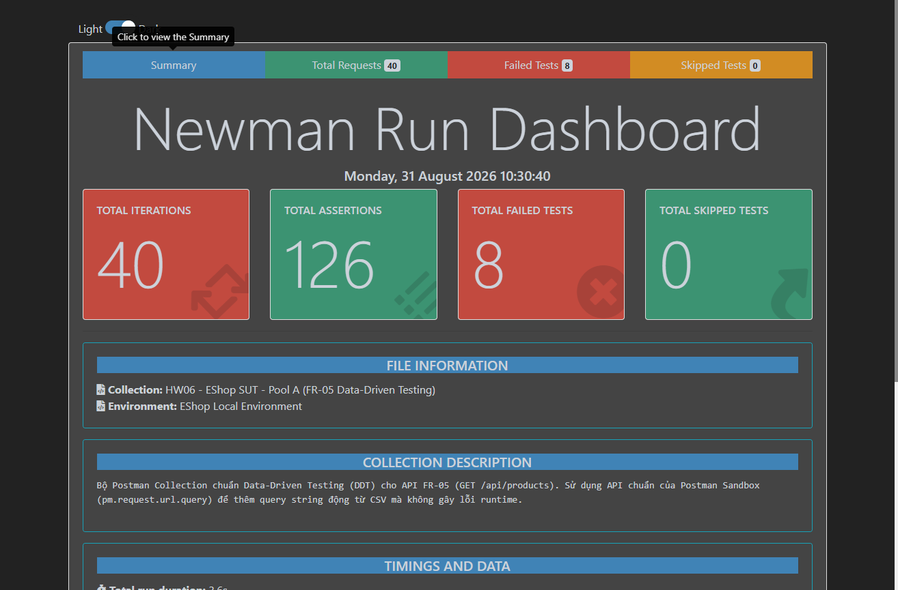
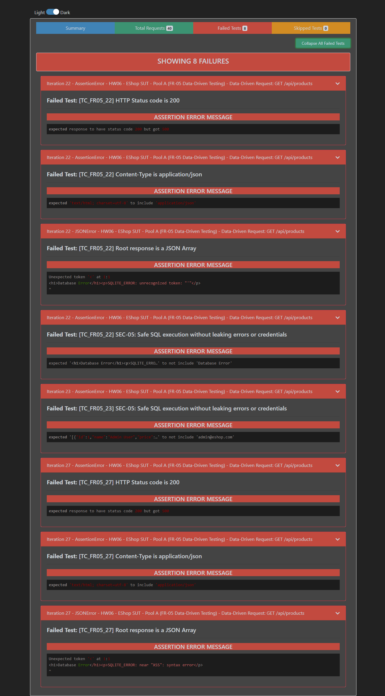

# Báo Cáo Khiếm Khuyết (Bug Report Table) — EShop SUT

Tài liệu này ghi nhận toàn bộ các lỗi (Defects/Bugs) phát hiện được trong quá trình kiểm thử tự động hệ thống EShop SUT theo quy chuẩn 9 cột quốc tế của môn học:

---

## 1. BẢNG TỔNG HỢP DANH MỤC LỖI (9 CỘT CHUẨN)

| Defect ID | Defect Title | Defect Description | Function ID | Severity | Reported By | Date Reported | Status | Comment |
| :---: | :--- | :--- | :---: | :---: | :--- | :---: | :---: | :--- |
| **B001** | [FR-05] Lỗ hổng SQL Injection trên endpoint `GET /api/products` khi tìm kiếm | **Pre-conditions:** Backend server EShop đang chạy ở `http://localhost:3000`.<br>**Steps to Reproduce:**<br>1. Gửi request `GET /api/products?search=' UNION SELECT id, name, email, password, 5, 6 FROM users--`.<br>2. Quan sát kết quả phản hồi.<br>**Actual Result:** Câu truy vấn SQL bị nối chuỗi trực tiếp (`WHERE name LIKE '%${searchQuery}%'`), dẫn đến câu lệnh SQL bị bẻ gãy và dump toàn bộ tài khoản, mật khẩu plaintext của Admin/Users.<br>**Expected Result:** Hệ thống phải sử dụng Parameterized Query để escape chuỗi an toàn theo yêu cầu **SEC-05**, chỉ tìm kiếm theo chuỗi nguyên bản.<br>**Environment:** Node.js Express, SQLite3, Windows 11. | FR-05 | **Critical** | Student | 30-08-2026 | Open | Vi phạm nghiêm trọng yêu cầu bảo mật SEC-05. Đã bắt trúng qua TC_FR05_22, TC_FR05_23, TC_FR05_27. |
| **B002** | [FR-05] Rò rỉ thông tin cấu trúc CSDL và trả về sai Content-Type (HTML thay vì JSON) khi SQL lỗi | **Pre-conditions:** Server EShop đang chạy.<br>**Steps to Reproduce:**<br>1. Gửi request `GET /api/products?search=iPhone'`.<br>2. Kiểm tra Header `Content-Type` và Body phản hồi.<br>**Actual Result:** Trả về HTTP 500 với body là chuỗi HTML `<h1>Database Error</h1><p>SQLITE_ERROR: unrecognized token: "'%"</p>` và Header `Content-Type: text/html`.<br>**Expected Result:** API luôn phải trả về định dạng `application/json` chuẩn `{"error": "Internal server error"}` và không làm lộ chi tiết lỗi kỹ thuật của SQLite.<br>**Environment:** Node.js Express, SQLite3, Postman/Newman. | FR-05 | **High** | Student | 30-08-2026 | Open | Vi phạm nguyên tắc bảo mật Information Disclosure và vi phạm API Contract Schema. |

---

## 2. CHI TIẾT KỸ THUẬT & BẰNG CHỨNG THỰC NGHIỆM

### 🐛 Defect B001: SQL Injection Data Leakage (Critical)
* **API Endpoint:** `GET /api/products?search={searchQuery}`
* **Vị trí mã nguồn gây lỗi:** [`backend/server.js:144`](file:///d:/NAM_3/HK3/KTPM/eshop-sut/backend/server.js#L144)
  ```javascript
  // Đoạn mã lỗi trong backend/server.js:
  const query = `SELECT * FROM products WHERE name LIKE '%${searchQuery}%'`;
  db.all(query, [], (err, rows) => { ... });
  ```
* **Payloads kiểm thử:**
  1. `?search=' OR '1'='1` (Bypass filter, trả về toàn bộ dữ liệu)
  2. `?search=' UNION SELECT id, name, email, password, 5, 6 FROM users--` (Dump toàn bộ thông tin tài khoản người dùng và mật khẩu Admin)
  3. `?search=iPhone'` (Làm vỡ cú pháp SQL gây crash 500)
* **Khắc phục đề xuất:**
  ```javascript
  const query = "SELECT * FROM products WHERE name LIKE ?";
  db.all(query, [`%${searchQuery}%`], (err, rows) => {
      if (err) return res.status(500).json({ error: "Internal server error" });
      res.json(rows);
  });
  ```

---

### 🐛 Defect B002: Information Disclosure & Content-Type Mismatch (High)
* **API Endpoint:** `GET /api/products?search={searchQuery}`
* **Vị trí mã nguồn gây lỗi:** [`backend/server.js:148`](file:///d:/NAM_3/HK3/KTPM/eshop-sut/backend/server.js#L148)
  ```javascript
  // Đoạn mã lỗi trong backend/server.js:
  if (err) return res.status(500).send('<h1>Database Error</h1><p>' + err.message + '</p>');
  ```
* **Hậu quả:** Trả về mã lỗi HTML thô, làm lộ thông điệp lỗi nội bộ của SQLite (`SQLITE_ERROR: unrecognized token`) cho kẻ tấn công, đồng thời phá vỡ JSON contract của RESTful API.
* **Khắc phục đề xuất:**
  ```javascript
  if (err) {
      console.error("[DB ERROR]", err.message);
      return res.status(500).json({ error: "Internal server error" });
  }
  ```

---

## 3. HÌNH ẢNH BẰNG CHỨNG THỰC NGHIỆM (NEWMAN EXECUTION REPORT)

### 📊 Tổng quan kết quả thực thi kiểm thử:


### ❌ Chi tiết các ca kiểm thử phát hiện lỗi (Failed Test Cases):

